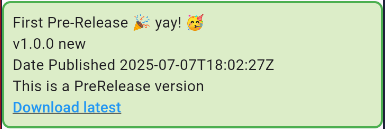

# 📦 Flutter Utility Library

A collection of nifty Flutter utilities & widgets to speed up development 🚀.  
This library contains handy functions and widgets like checking for the latest GitHub release of any repository and show the user to download the said library.

## ✨ Features

- 🔍 **[GitHub Release Checker](#github-release-checker)** – Easily detect if a new release is available.
- 🧰 More utilities coming soon!

## GitHub Release Checker

### Dependency
```yaml
name: dart_release_checker
environment:
  sdk: ">=3.0.0 <4.0.0"

dependencies:
  http: ^1.2.1
  url_launcher: ^6.3.1
```

### 🛠️ Example Usage

```dart
home: Scaffold(
    body: WidgetGitReleaseChecker(
        user: 'Holy-Warrior',
        repo: 'timetable-management',
        currentRelease: 'v0.0.0',
        filterOutPreRelease: false,
        ),
    ),
```

### 🎯 Result

